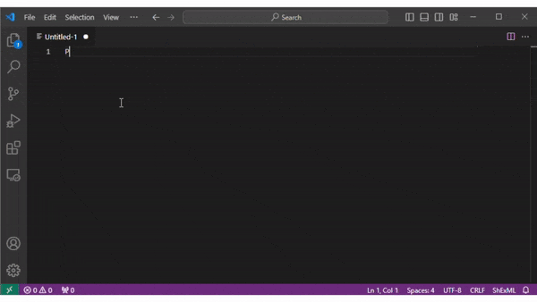

# shexml-syntax-highlighter

[](https://marketplace.visualstudio.com/items?itemName=herminiogg.shexml-syntax-highlighter)

This is an extension providing syntax highlighting for the [Shape Expressions Mapping Language (ShExML)](https://github.com/herminiogg/ShExML) using a TextMate grammar in Visual Studio Code.

## Features

The extension can highlight the different tokens used in ShExML depending on their context and importance. Take into account that this is not full grammar nor a language server so it will not provide autocorrection or autocompletion for the code.

You can see it in action here:



## Installation
You can clone this repository, package and install it in your own Visual Studio Code using the following commands:

First, you need to ensure that you have Node.js installed to then install the vsce tool:
```
$ npm install -g @vscode/vsce
```

Then, create a package with the extension code using:
```
$ vsce package
```

Finally, install it in your Visual Studio Code instance:
```
$ code --install-extension shexml-syntax-highlighter-0.1.0.vsix
```

> Alternatively, you will be able to install it from the marketplace very soon...

## Release Notes

See the file [CHANGELOG.md](CHANGELOG.md) for further details about the release notes per version.
